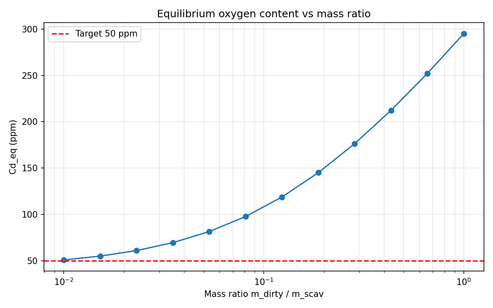

# Oxygen Diffusion in Powder Metallurgy Systems

## Overview
This project simulates oxygen diffusion between two powder particles in contact: a "dirty" powder particle containing elevated oxygen concentrations, and a clean scavenger particle (tantalum) that acts as an oxygen sink. The model is formulated as an ODE initial value problem and solved numerically using `scipy.integrate.solve_ivp`.

The primary goal is to predict the time required to reduce oxygen content in dirty powder to a target concentration, and to map how mass ratio and size ratio between particles affect equilibrium outcomes.

## Physical Model
Oxygen flux between particles is driven by the chemical potential gradient, approximated using normalized concentration relative to each material's solubility limit. Diffusivity in each material follows an Arrhenius relationship:

```
D = D0 * exp(-Q / RT)
```

The characteristic diffusion timescale for each particle is estimated as:

```
τ = R² / D
```

Equilibrium concentrations are validated against an analytical solution derived from mass balance and thermodynamic partitioning.

## Repository Structure
```
├── diffusion.py      # Single-condition simulation and plotting
├── optimizer.py      # 2D sweep over mass ratio and size ratio
├── materials.py      # Material constants (D0, Ea, solubility limits)
├── plots.py          # Reusable plotting functions
├── requirements.txt  # Python dependencies
```

## Installation
```bash
git clone https://github.com/MJPavel1/Oxygen_Diffusion.git
cd Oxygen_Diffusion
pip install -r requirements.txt
```

## Usage
Run a single diffusion simulation with parameters defined in `diffusion.py`:
```bash
python diffusion.py
```

Run the optimizer sweep across mass and size ratios:
```bash
python optimizer.py
```

Key parameters (set at the top of each script):
- `T` — temperature in °C (converted to K internally)
- `Cd0` — initial oxygen in dirty powder (wt ppm)
- `Cs0` — initial oxygen in scavenger (wt ppm)
- `mass_dirty`, `mass_scav` — relative particle masses
- `Rd`, `Rs` — particle radii (m)

## Example Output


## Author
Michael Pavel — materials scientist
